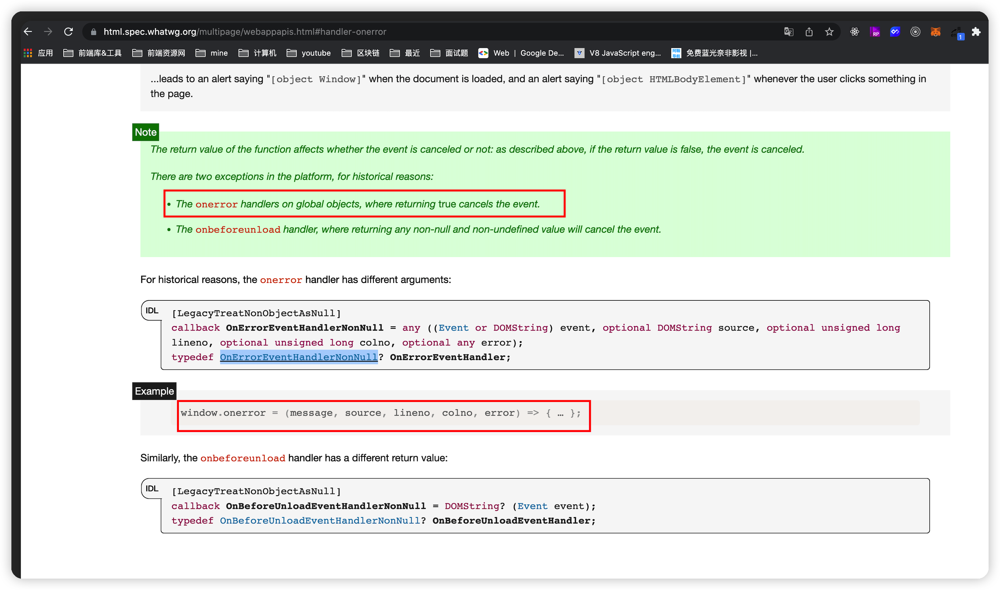

### 关于 error

1.  window.onerror 与 window.addEventListener('error',handle) 区别？

    - window.onerror 可以设置全局的 js 运行时异常和语法错误，但是不能捕获资源加载异常；如果返回 true 会取消事件；

    - window.addEventListener('error',handle) 全局设置;
      监听 js 运行时错误事件，会比 window.onerror 先触发，与 onerror 的功能大体类似，不过事件回调函数传参只有一个保存所有错误信息的参数，不能阻止默认事件处理函数的执行，但可以全局捕获资源加载异常的错误；

    ```
        window.addEventListener('error', function (event) {
            const { message, source, lineno, colno, error,target } = event;
            // 通过targer来区分
            if(target && (target.src||target.href)){
            // 资源加载异常 resourceError
            if(target.tagName==='script'){
                // script脚本资源加载异常
            }
                if(target.tagName==='img'){
                // img资源加载异常
            }
                // todo 上报异常
            }else{
            // js异常 jsError
            // 可以查看error信息查看具体原因
            // todo 上报异常
            }

        }, true);

    ```

2.  如图关于 handler-onerror
    

> https://developer.mozilla.org/en-US/docs/Web/API/Window/error_event
